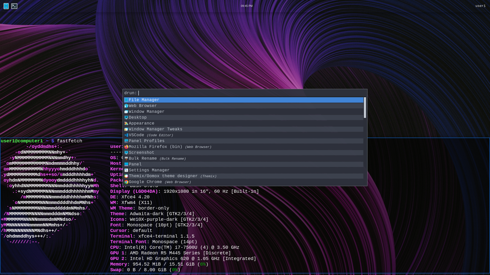

# linux themes base



## install
```sh
git init -b main $HOME && git remote add origin https://github.com/linuxthemes/base
```
```sh
git pull && git submodule update --init --recursive
```

## themes

Switch themes 
```sh
git checkout tokoyo-night
```

Make your own theme!
```sh
git -b checkout the-best-theme 
```
```sh
git push 
```

base themes list
```sh
base
nord
catppuccin-latte
catppuccin
everforest
gruvbox
kanagawa
matte-black
osaka-jade
ristretto
rose-pine
tokyo-night
```


